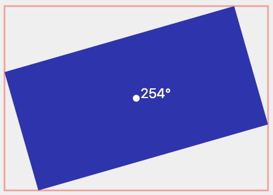

[](https://restaurantclub.pl/)

# React Developer - Rekrutacja (logic)

## Zadanie
Twoje zadanie to napisanie aplikacji renderujacej dane pobrane z serwera. Serwer zwraca dane opisujące abstrakcyjne `płótno` na którym umieszczone zostały losowo rozmieszczone różnokolorowe prostokąty. Wykorzystaj przygotowane API aby pobrać dane.

### Wymagania
1. Pobierz informację o projekcie z końcówki/init o ile użytkownik nie podał ID projektu
2. Pobierz opis projektu /project/{id} korzystając z id projektu
3. Narysować wizualną reprezentację pobranego projektu. Można rysować zarówno SVG jak i HTML - do wyboru. Każdy element projektu jest opisany przez położenie, wymiar oraz obrót. (uwaga położenie obiektu jest zawsze definiowane względem jego środka, wymiary `width`/`height` podane w układzie lokalnym tj. nieobroconym)
4. Dla każdego elementu na scenie proszę policzyć (bez używania API DOM) i narysowac minimalny prostokąt ograniczający (bounding box)
5. Dla każdego narysowanego elementu, zaznaczyć punkt środkowy oraz informację o obrocie elementu
6. Projekt powinien być automatycznie skalowany tak aby zawsze był widoczny w całości, rownież po zmianie rozmiaru okna przeglądarki.
Użytkownik powinien mieć możliwosć wyrenderowania dowolnego projektu podąjac jego ID (w tym scenariuszu aplikacja powinna pominąć krok 1.)
7. Aplikacja powinna poprawnie osbługiwać błędy API
8. Proszę zaproponować (bez potrzeby implementacji) jakie uwagi powinny zostać zgłoszone do autora API oraz jakie testy powinny być napisane dla tej aplikacji.

### Przykład

Przyklad poprawnie wyrenderowanego element



Właściwości elementu

```json
{
    "id": "$179",
    "color": "#3230b3",
    "rotation": 254,
    "x": 169,
    "y": 442,
    "width": 144,
    "height": 280
}
```

### API

> `/init` zwraca podstawowe informację dla projektu  

paremetry: `none`  
response:

```json
{
    "id": "string", // unikatowe id projektu
    "name": "string", //nazwa projektu
    "modified": 1642182762 // timestamp
}
```

> `/project/{id}` zwraca opis projektu

parametry: query `id` -  id projektu  
response:

```json
{
    "id": "string", // unikatowe id projektu jak podane w parametr
    "project": {
        "id": "string", // j.w.
        "name": "string", // nazwa projektu
        "width": 10, // szerokosc płótna projektu
        "height": 10, // wysokosc płótna projektu
        "items": // tablica elementów umieszczonych na plotnie
        [
            {
                "id": "string", // unikatowe id elementu
                "color": "string", // color elementu w formacie "#RRGGBB"
                "rotation": 0, // kąt obrotu elementu [0°, 360°]
                "x": 10, // współrzędna X środka elementu
                "y": 20, // współrzędna Y środka elementu
                "width": 100, // szerokość elementu (>0)
                "height": 200 // wysokość elementu (>0)
            }
        ]
    }
}
```

### Technologie

Poza wymaganiami przedstawionymi w grupie Wymagane można używac dowolnych rozwiązań.

Wymagane:
- **react** - mozna uzyc generatora (np.create-react-app)

Opcjonalne:
- **TypeScript** 
- **redux** - do obsługi stanu aplikacji

### Dodatki

Projekty które zawsze powodują błąd:  

ID `cklzhx7e80001py9kcql231z3-4748779261984095` daje  błąd `500` serwera  
ID `cklziyda30000m19k92zfao28-9430719080200028` daje błąd `404` serwera  
ID `cklzjw3mn0001cq9k3mvy3fvf-7941218198815694` zwraca błędne dane

### Rozwiązanie

Przykładowe rozwiązanie można zobaczyć w linku poniżej

[Zobacz przykladowe rozwiazanie](https://recruitment01.vercel.app/example)

Wykonane zadanie prosze umieścić na publicznym repozytorium.